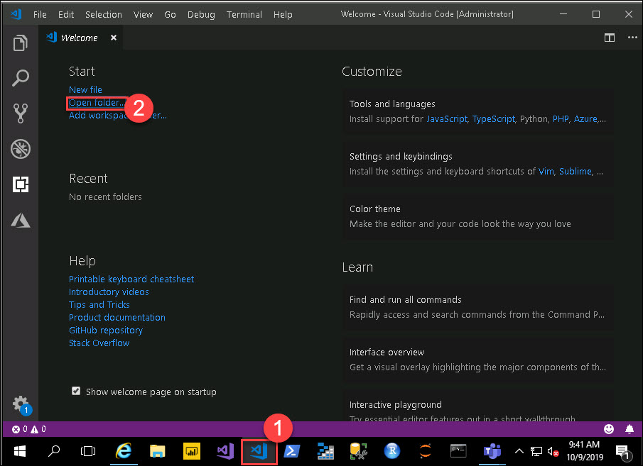

#  Training a Machine Learning Model using Azure Machine Learning service
In this lab you will setup the Azure Machine Learning service from code and create a classical machine learning model that logs metrics collected during model training.

## Exercise 1 - Get oriented to the lab files
1. In your virtual machine expand the folder `01-model-training` which is under `C:\LabFiles\azure-machine-learning-service-labs-master\starter-artifacts\visual-studio-code\01-model-training`
2. Expand the `data` folder. This folder contains two CSV files. `UsedCars_Clean.csv` represents the unlabeled data and `UsedCars_Affordability.csv` contains the complete data set with labels (Affordable is 1 for affordable, 0 for not affordable).<br/>
    <br/>
3. Expand `training`. This folder contains train.py which will be used later in the lab to train the model using a remote cluster provided by AML Compute.<br/>
    <br/>
4. To run a lab, start Visual Studio Code from taskbar and click on **Open folder**:<br/>
    <br/>
5. Select `01-model-training` folder which is under `C:\LabFiles\azure-machine-learning-service-labs-master\starter-artifacts\visual-studio-code\`
    <br/>
6. Select the `01_model_training.py` python file from **Explorer**
    <br/>
7. For Interpreter command go to **View** and Select **Command Palette** (⇧⌘P).<br/>
    <br/>
8. Click on **Python: Select Interpreter**. This will take 4-5 minutes<br/>
    <br/>
9. Once you setup the python interpreter, select conda environmen `azure_automl`<br/>
    <br/>
10. `01_model_training.py` is the Python file you will step through executing in this lab.<br/>
11. Next, follow the steps as outlined below **Exercises**. For executing each cell in below execises click on **Run Cell** i.e, just above the step for each steps as show below.
    <br/>

## Exercise 2 - Train a simple model locally
1. Execute **Step 1**. Take a moment to look at the data loaded into the Pandas Dataframe - it contains data about used cars such as the price (in dollars), age (in years), KM (kilometers driven) and other attributes like weather it is automatic transimission, the number of doors, and the weight.<br/>
    <br/>
2. In **Step 2**, we are going to try and build a model that can answer the question "Can I afford a car that is X months old and has Y kilometers on it, given I have $12,000 to spend?". We will engineer the label for affordable. Execute **Step 2**.<br/>
    <br/>
3. We are going to train a Logistic Regression model locally. This type of model requires us to standardize the scale of our training features Age and KM, so we use the `StandardScaler` from Scikit-Learn to transform these features so that they have values centered with a mean around 0 (mostly between -2.96 and 1.29). Execute **Step 3**. Observe the difference in min and max values between the un-scaled and scaled Dataframes.<br/>
    <br/>
4. Train the model by fitting a LogisticRegression against the scaled input features (X_scaled) and the labels (y). Execute **Step 4**.<br/>
    <br/>
5. Try prediction - if you set the age to 60 months and km to 40,000, does the model predict you can afford the car? Execute **Step 5**.<br/>
    <br/>
6. Now, let's get a sense for how accurate the model is. Execute **Step 6**. What was your model's accuracy?<br/>
    <br/>
7. One thing that can affect the model's performance is how much data of all the labeled training data available is used to train the model. In **Step 7**, you define a method that uses train_test_split from Scikit-Learn that will enable you to split the data using different percentages. Execute **Step 7** to register this function.
    <br/>

## Exercise 3 - Use Azure Machine Learning to log performance metrics
In the steps that follow, you will train multiple models using different sizes of training data and observe the impact on performance (accuracy). Each time you create new model, you are executing a Run in the terminology of Azure Machine Learning service. In this case, you will create one Experiment and execute multiple Runs within it, each with different training percentages (and resultant varying accuracies).

1. Execute **Step 8** to quickly verify you have the Azure Machine Learning SDK installed. If you get a version number back without error, you are ready to proceed.<br/>
2. Copy the `subscription_id`, `workspace_region` and `resource_group` from your **Environment Detail Page**<br/>
   <br/>
3. All Azure Machine Learning entities are organized within a Workspace. You can create an AML Workspace in the Azure Portal, but as the code in Step 9 shows, you can also create a Workspace directly from code. Set the values for '`subscription_id`, `resource_group`, `workspace_nam` and `workspace_region` as directed by the comments. Set the `workspace_region` as the per your resource group region.<br/>
   <br/>
3. Execute **Step 9**. You will be prompted to log in to your Azure. Use the **Azure credentials** that are given in your **Environment Detali Page**. If you didn't get **Login** prompt go to **Internet Explorer**<br/>
   <br/>
 * Copy the **Password** from **Environment Detali Page** and Paste in Sign in page
   <br/>   
5. Check the Output in **Python Interactive**
   <br/>
4. To begin capturing metrics, you must first create an Experiment and then call `start_logging()` on that Experiment. The return value of this call is a Run. This root run can have other child runs. When you are finished with an experiment run, use `complete()` to close out the root run. Execute **Step 10** to train four different models using differing amounts of training data and log the results to Azure Machine Learning.<br/>
   <br/>
5. Now that you have captured history for various runs, you can review the runs. You could use the Azure Portal for this - go to the Azure Portal, find your Azure Machine Learning Workspace, select Experiments and select the UsedCars_Experiment. However, in this case we will use the AML SDK to query for the runs. Select and execute **Step 11** to view the runs and their status.<br/>
    <br/>

## Exercise 4 - Train remotely using AML Compute
Up until now, all of your training was executed locally on Azure Notebooks. Now you will execute the same logic targeting a remote AML Compute cluster, which you will provision from code.

1. Read and then execute **Step 12** in which you will create an AML Compute cluster using code. Once your cluster is ready, you should see output similar to the following:

```
Creating a new compute target...
Creating
succeeded.....
BatchAI wait for completion finished
Minimum number of nodes requested have been provisioned
{'allocationState':'steady','allocationStateTransitionTime':'2018-11-17T17:56:07.361000+00:00','creationTime':'2018-11-17T17:52:53.601000+00:00','currentNodeCount':1,'errors':None,'nodeStateCounts':{'idleNodeCount':0,'leavingNodeCount':0,'preparingNodeCount':1,'runningNodeCount':0,'unusableNodeCount':0},'provisioningState':'succeeded','provisioningStateTransitionTime':'2018-11-17T17:53:59.653000+00:00','scaleSettings':{'manual': None,'autoScale':{'maximumNodeCount':3, 'minimumNodeCount':1,'initialNodeCount':1}},'vmPriority':'lowpriority','vmSize':'STANDARD_DS11_V2'}

```

2. With your cluster ready, you need to upload the training data to the default DataStore for your AML Workspace (which uses Azure Storage). Execute **Step 13** to upload the data folder.<br/>
    <br/>
3. Next, you will need to create a training script that is similar to the code you have executed locally to train the model. Open `training/train.py` and read it. You do not need to execute this script, as you will send it to AML Compute for execution.<br/>
4. Return to `01_model_training.py`. You will create an estimator that describes the configuration of the job that will execute your model training script. Execute **Step 14** to create this estimator.<br/>
    <br/>
5. As the last step, submit the job using the `submit()` method of the Experiment object. Execute **Step 15** to remotely execute your training script. The output you should see will begin with the creation of a Docker Container that contains your configured dependencies, followed by the execution of your training script.
    <br/>
