# Using Azure Machine Learning service Model Versioning and Run History

In this lab you will use the capabilities of the Azure Machine Learning service to collect model performance metrics and to capture model version, as well as query the experimentation run history to retrieve captured metrics. 

## Exercise 1 - Get oriented to the lab files
1. On your local computer expand the folder `:\labfiles\azure-machine-learning-service-labs-master\starter-artifacts\visual-studio-code\02-model-management`. 
2. Expand the `data` folder. This folder contains the CSV file `UsedCars_Affordability.csv` which contains the complete data set with labels (Affordable is 1 for affordable, 0 for not affordable). 
    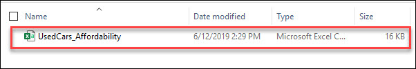 
3. Expand `training`. This folder contains train.py which will be used later in the lab to train the model using a remote cluster provided by AML Compute. 
    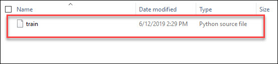 
4. To run a lab, start Visual Studio Code from taskbar and click on **Open Folder**: 
     
5. Select `02-model-management` folder which is under `C:\LabFiles\azure-machine-learning-service-labs-master\starter-artifacts\visual-studio-code\` 
    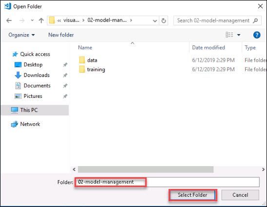    
6. Select the `02-model-management.py` python file from **Explorer**
7. For Interpreter command go to **View** and Select **Command Palette** (⇧⌘P). 
    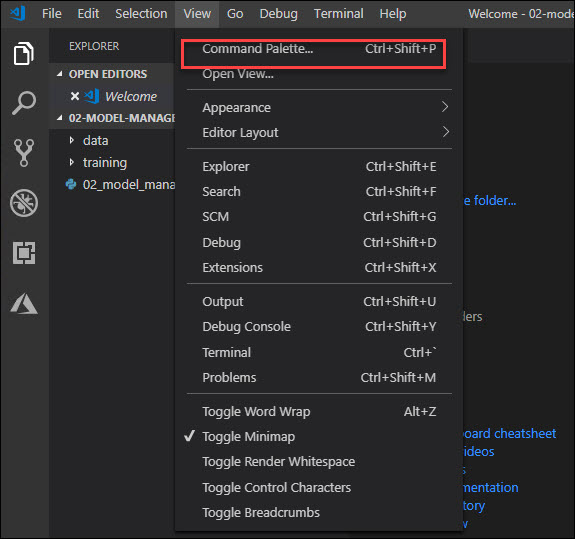 
8. Click on **Python: Select Interpreter**. This will take 4-5 minutes 
    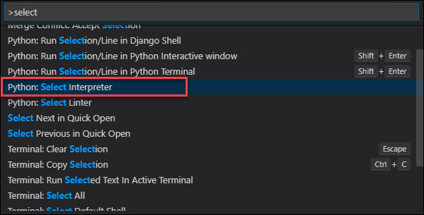 
9.  Once you setup the python interpreter, select conda environmen `azure_automl` 
    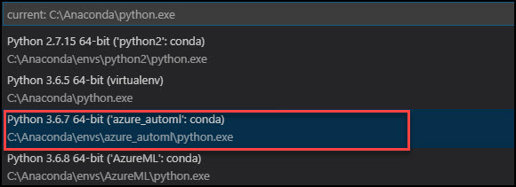 
10. `02-model-management.py` is the Python file you will step thru executing in this lab. 
11.  Next, follow the steps as outlined below **Exercises**. For executing each cell in below execises click on **Run Cell** i.e, just above the step for each steps as show below. 
    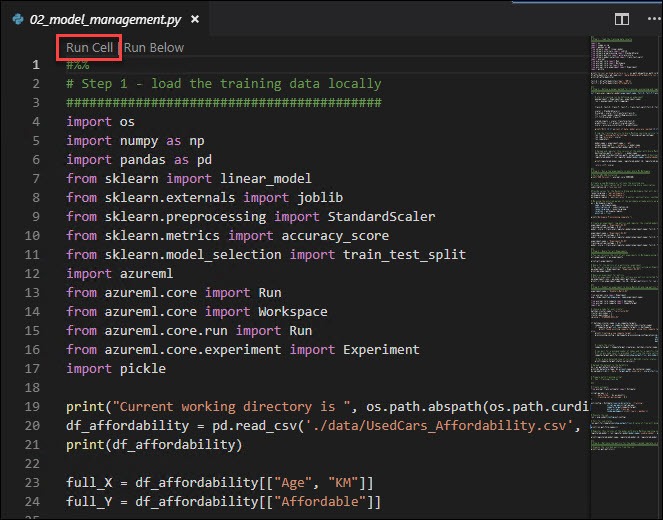 

## Exercise 2 - Train a simple model locally
This lab builds upon the lessons learned in the previous lab, but is self contained so you work thru this lab without having to run a previous lab. As such Steps 1, 2 and 3 in the lab are not explored in detail as their goal is to setup a few experiment runs, which was covered in detail in Lab 1.
1. Execute **Step 1**. Take a moment to look at the data loaded into the Pandas Dataframe - it contains data about used cars such as the price (in dollars), age (in years), KM (kilometers driven) and other attributes like weather it is automatic transimission, the number of doors, and the weight. 
    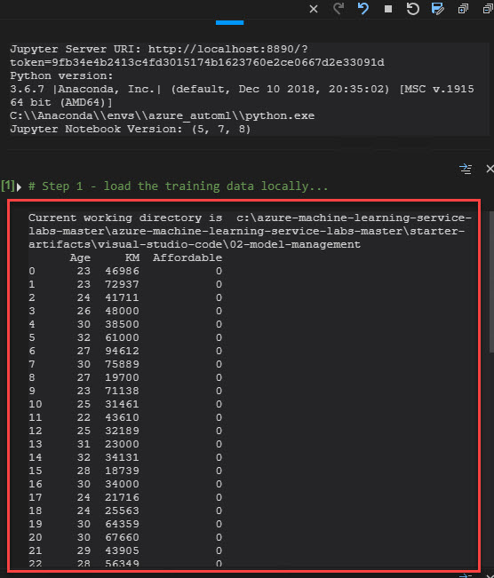 
2. In **Step 2**, we will define a helper method that locally trains, evaluates and then registers the trained model with Azure Machine Learning. **Execute** Step #2. 
    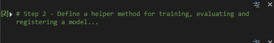 
3. In this step, Get the values for `subscription_id`, `resource_group` and `worspace_region` from your **Environment Detail Page** 
   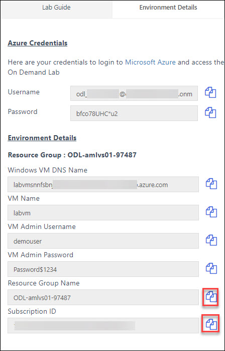 
4. Set the values for `subscription_id`, `resource_group`, `workspace_name` and `workspace_region`. 
 *  Set the `workspace_region` as the per your resource group region 
   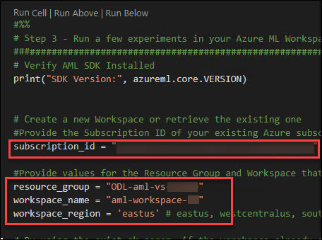 
6. With the Workspace retrieved, we will train 3 different models using different subsets of the training data. **Execute** Step #3. You will be prompted to log in to your Azure. Use the **Azure credentials** that are given in your **Environment Detali Page**. If you didn't get **Login** prompt go to **Internet Explorer** 
   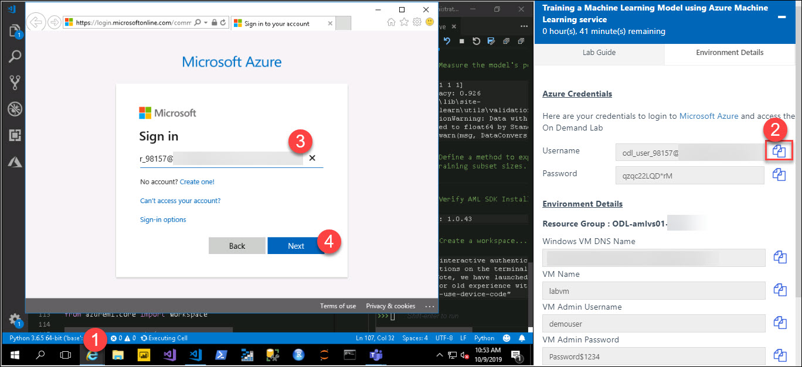 
 * Copy the **Password** from **Environment Detali Page** and Paste in Sign in page 
   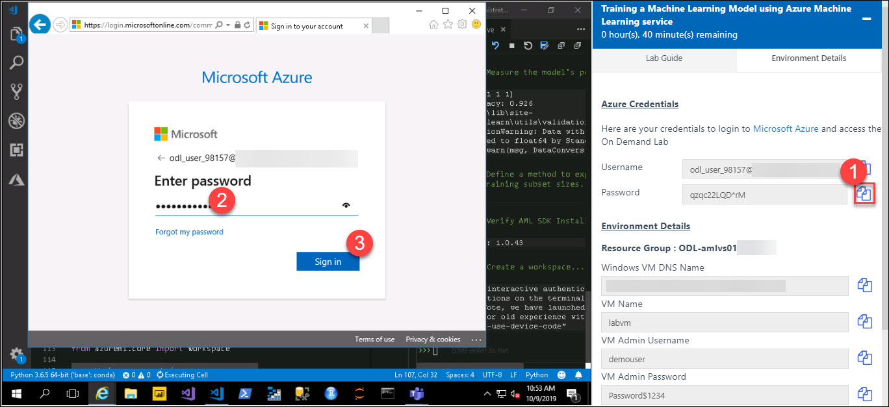 
7. Check the Output in **Python Interactive** 
   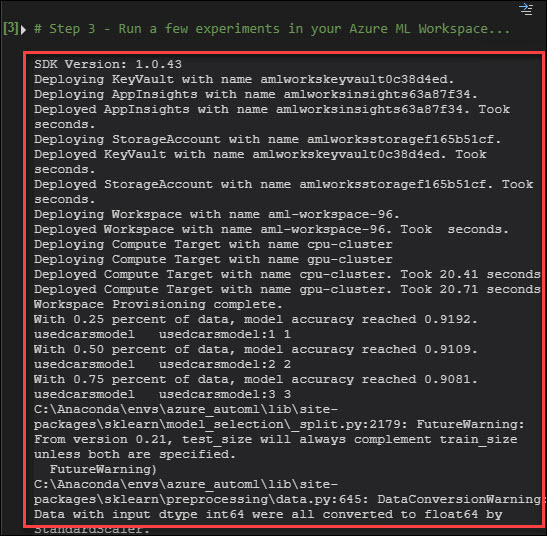 

## Exercise 3 - Use Azure Machine Learning to query for performance metrics
1. As was demonstrated in the previous lab, you can use the Workspace to get a list of Experiments. You can also query for a particular Experiment by name. With an Experiment in hand, you review all runs associated with that Experiment and retrieve the metrics associated with each run. Execute Step #4 to see this process. What was the accuracy of the only run for Experiment-02-03? 
   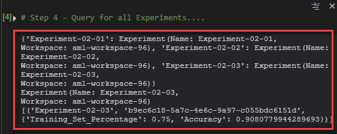 
## Exercise 4 - Remotely train a model in AML Compute
1. Remote model training was covered in the previous lab. **Execute** Step #5 to create or retreive your **AML Compute** cluster and the submit to it a model training job. Wait for the run to complete before proceeding to the next exercise. 
   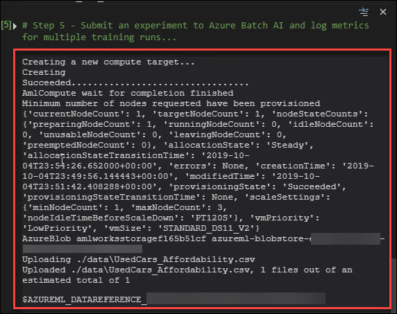 
## Exercise 5 - Retrieve metrics for the remote Run
1.Execute the cell to **Create Estimator** 
 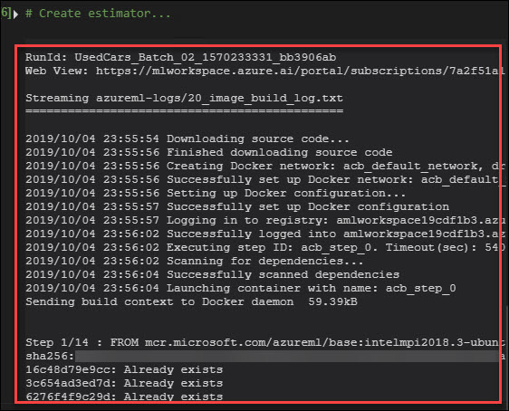 
2. You can easily retrieve the metrics for a Run executed remotely by using `run` object returned by the call to **Experiment.submit**. **Execute** Step 6 to retrieve metrics for the run you just executed. What was the accuracy of the run? 
   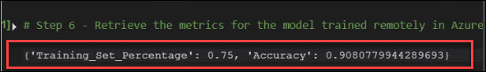 
