# Model Training with AutoML

In this lab you will us the automated machine learning (Auto ML) capabilities within the Azure Machine Learning service to automatically train multiple models with varying algorithms and hyperparameters, select the best performing model and register that model.

## Exercise 1 - Get oriented to the lab files

1. In your virtual machine expand the folder `C:\LabFiles\azure-machine-learning-service-labs-master\starter-artifacts\visual-studio-code\04-automl`. 
2. Expand the `data` folder. This folder contains the CSV file `UsedCars_Affordability.csv` which contains the complete data set with labels (Affordable is 1 for affordable, 0 for not affordable). 
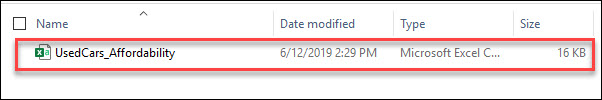 
3. To run a lab, start Visual Studio Code from taskbar and click on **Open folder**: 
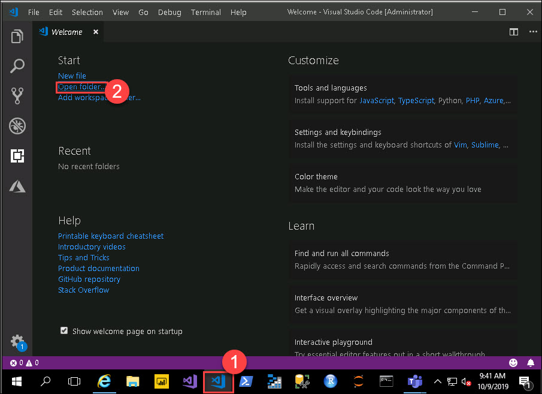 
4. Select `04-automl` folder which is under `C:\LabFiles\azure-machine-learning-service-labs-master\starter-artifacts\visual-studio-code\` 
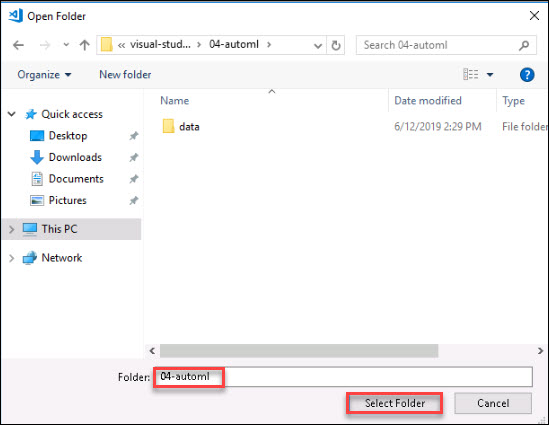 
``
Please install if you are prompted to install Python. Ignore other extensions because we don't require for this lab.
``
5. Select the `04-automl.py` python file from **Explorer** 
6. For Interpreter command go to **View** and Select **Command Palette** (⇧⌘P). 
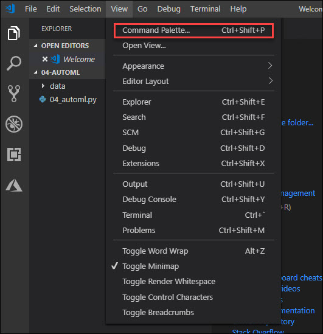 
7. Click on **Python: Select Interpreter**. This may take 4-5 minutes 
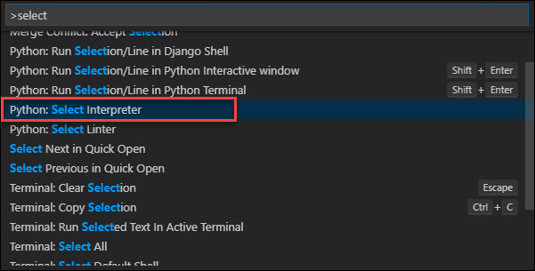 
8. Once you setup the python interpreter, select conda environmen `azure_automl` 
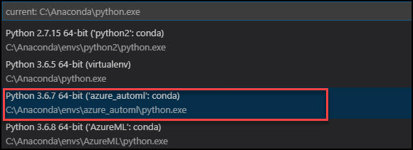 
9. `04_automl.py` is the Python file you will step thru executing in this lab. 
10. Refer below image for executing each cell i.e, just above all steps in below exercises 
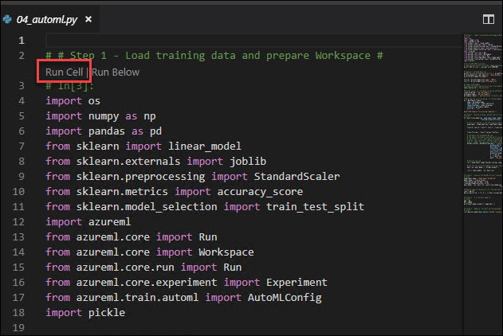 

## Exercise 2 - Train a model using AutoML

This lab built upon the lessons learned in the previous lab but is self-contained so you work through this lab without having to run a previous lab.  
1. Begin with **Step 1**. In this step you are loading the data prepared in previous labs and acquiring (or creating) an instance of your Azure Machine Learning Workspace. Copy **subscription_id**, **resource_group** and **workspace_region** from your Environment Detail Page will be using these values in below step 
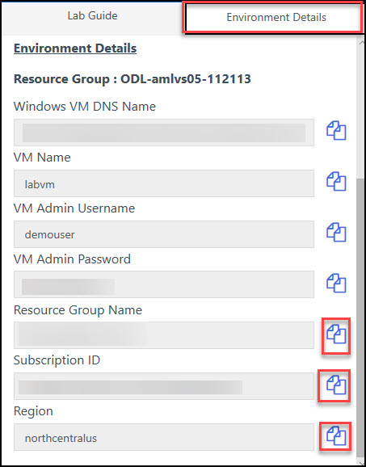 
2. Set the values for **subscription_id**, **resource_group** and **workspace_region** that you copied in above step. And give any unique name for **workspace_name** 
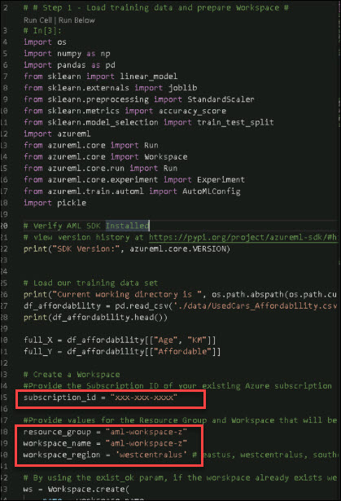 
3. Execute **Step 1**. You will be prompted to log in to your Azure. Use the **Azure credentials** that are given in your **Environment Detail Page**. If you didn't get **Login** prompt go to **Internet Explorer** 
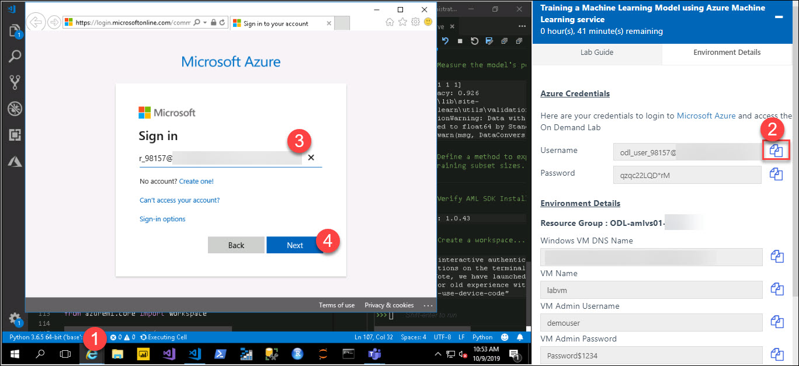 
4. Copy the **Password** from **Environment Detail Page** and Paste in Sign in page 
 
5. Check the Output in **Python Interactive** 
 
6. To train a model using **AutoML** you need only provide a configuration for AutoML that defines items such as the type of model (classification or regression), the performance metric to optimize, exit criteria in terms of max training time and iterations and desired performance, any algorithms that should not be used, and the path into which to output the results. This configuration is specified using the `AutomMLConfig` class, which is then used to drive the submission of an experiment via `experiment.submit`. When AutoML finishes the parent run, you can easily get the best performing run and model from the returned run object by using `run.get_output()`. **Execute** Step 2 to define the helper function that wraps the AutoML job submission. 
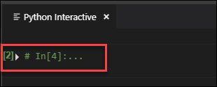 
7. In **Step 3**, you invoke the AutoML job. **Execute** Step 3. 
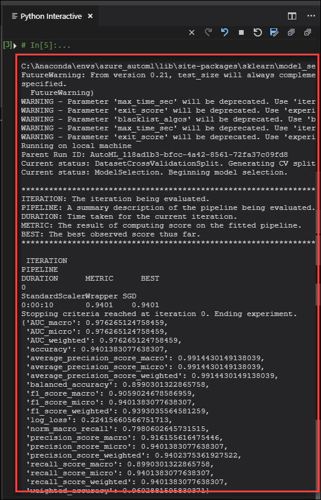 
8. Try out the best model by using Step 4. 
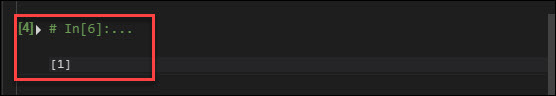 

## Exercise 3 - Register an AutoML created model

1. You can register models created by **AutoML** with Azure Machine Learning just as you would any other model. **Execute** Step 5 to register this model. 
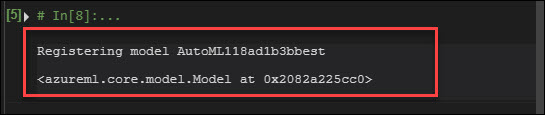 
