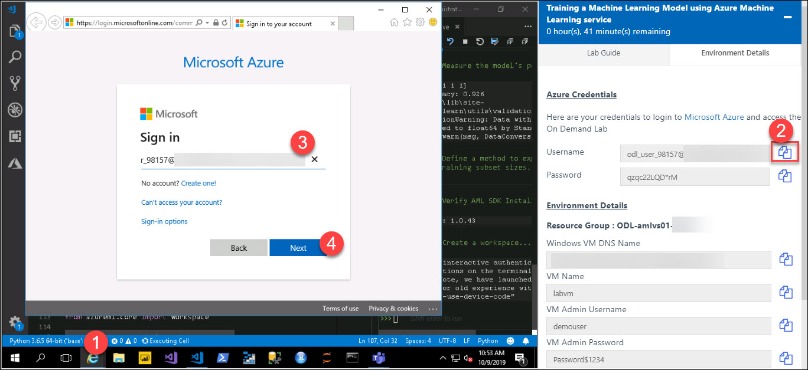

# Deep Learning

In this lab you train deep learning models built with Keras and a Tensorflow backend that utilize GPUs with the Azure Machine Learning service.

## Exercise 1 - Get oriented to the lab files
1. In your virtual machine expand the folder `C:\LabFiles\azure-machine-learning-service-labs-master\starter-artifacts\visual-studio-code\05-deep-learning`. 
2. To run a lab, start Visual Studio Code from taskbar and click on **Open folder**: 
     
3. Select `05-deep-learning` folder which is under `C:\LabFiles\azure-machine-learning-service-labs-master\starter-artifacts\visual-studio-code\` 
     
4. Select the `05-deep-learning.py` python file from **Explorer**
5. For Interpreter command go to **View** and Select **Command Palette** (⇧⌘P). 
     
6. Click on **Python: Select Interpreter**. This will take 4-5 minutes 
     
7.  Once you setup the python interpreter, select conda environmen `azure_automl` 
     
8. `05-deep-learning.py` is the Python file you will step thru executing in this lab. 
9. Next, follow the steps as outlined below **Exercises**. For executing each cell in below execises click on **Run Cell** i.e, just above the step for each steps as show below. 
    

## Exercise 2 - Train an autoencoder using GPU
1. Start with **Step 1**. Here you will use Keras to define an autoencoder. Don't get hung up on the details of constructing the auto-encoder. The point of this lab is to show you how to train neural networks using GPU's. Execute Step 1. In the output, verify that `K.tensorflow_backend._get_available_gpus()` returned an entry describing a GPU available in your environment. 
 
2. Once you have your autoencoder model structured, you need to train the the underlying neural network. Training this model on regular CPU's will take hours. However, you can execute this same code in an environment with GPU's for better performance. Execute Step 2. How long did your training take? 
 
3. With a trained auto-encoder in hand, try using the model by selecting and executing **Step 3**. 
 

## Exercise 3 - Register the neural network model with Azure Machine Learning
1. In this step, Get the values for `subscription_id`, `resource_group` and `workspace_region` from your **Environment Detail Page** 
 
2. Set the values for subscription_id, resource_group, workspace_name and workspace_region. 
*  Set the `workspace_region` as per your resource group region 
 
3. Execute **Step 4** to register the model.You will be prompted to log in to your Azure. Use the **Azure credentials** that are given in your **Environment Detali Page**. If you didn't get **Login** prompt go to **Internet Explorer** 
 
* Copy the **Password** from **Environment Detali Page** and Paste in Sign in page 
 
4. Observe that you can register a neural network model with Azure Machine Learning in exactly the same way you would register a classical machine learning model. 
 
